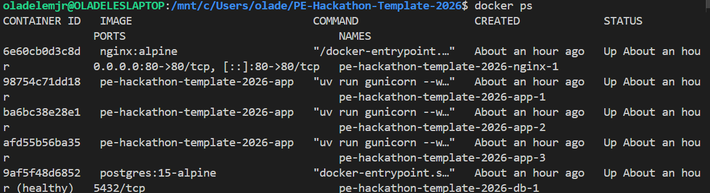
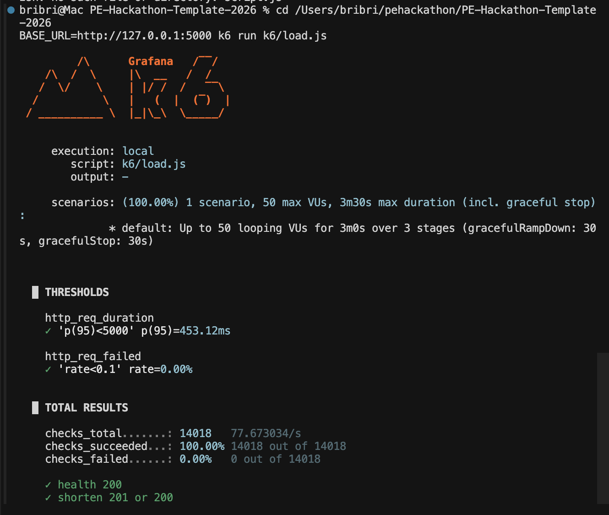
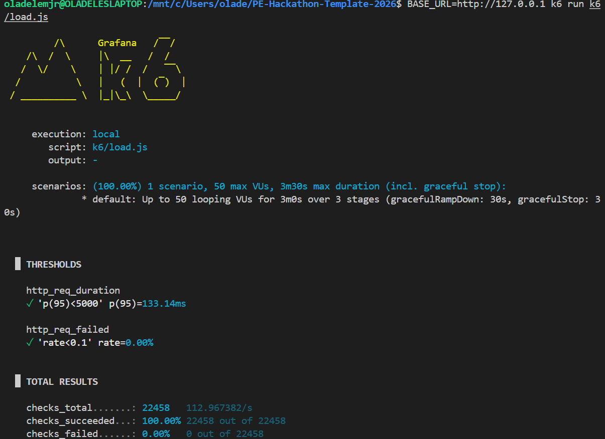

# 🚀 Architecture Bottleneck Analysis

To ensure our URL shortener could survive a massive influx of traffic (the 500-User Tsunami), we load-tested our infrastructure using **K6**. During this we identified multiple critical bottlenecks that would otherwise brick our infrastructure. Here are some of the problems and the solutions we engineered to solve them.

## Bottleneck 1: The Initialization Stampede (Multiple Containers trying to initialize the DB)

**Issue:** When scaling our application to multiple Docker containers, the containers would enter a crash-loop and continuously restart.

**The Culprit:** All three containers were waking up at the exact same millisecond and attempting to execute create_tables() in Postgres at the same time. This caused a duplicate key value violates unique constraint error, crashing the Python process.

**The Fix:**
 We implemented a healthcheck in docker-compose.yml so the clones wait for the database to fully initialize before booting.

We also wrapped the initialization logic in the database python file in a try except block to mitigate that. If multiple clones attempt to create the tables at once, the other containers that do not do the table creation just go immediately to the actual logic instead of crashing.

**Fix:**

## Bottleneck 2: The Single-Lane Server (Concurrency Limits)

**Issue:** During our first 50-user load test, we noticed an extremely large latency for our apps

**The Culprit:** The default Python package runner (uv run run.py) uses Flask's built-in development server. Although adequate for a regular hackathon  the flask server handles requests one at a time. When 50 users hit the server, 49 were forced to wait in a queue.

**The Fix:** We replaced the development server with *Gunicorn*, a production-grade WSGI HTTP server. By updating our Docker command in our dockerfile to `uv run gunicorn --workers 4 --threads 2 --bind 0.0.0.0:5000 run:app`, we made the single lane into an 8-lane highway per each docker container, allowing 24 simultaneous connections across our clone army, which heavily reduced our latency from the k6.

**Fix:**

### 🏆 Final Load Test Results
By addressing these three bottlenecks, our infrastructure successfully routed, processed, and served **500 concurrent users** maintaining a 100% success rate with zero container crashes.