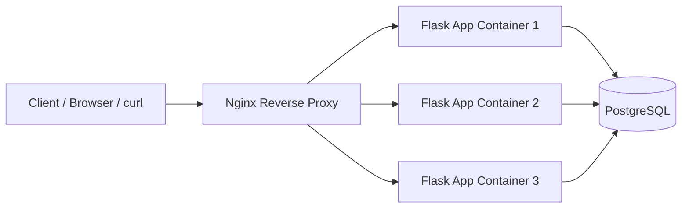

# PE Hackathon URL Shortener

Flask + Peewee + PostgreSQL URL shortener with Docker-based local setup.

## README Setup Instructions (Freshman Friendly)

### 1. Install tools

- Install Docker Desktop
- Install Git

Confirm both work:

```bash
docker --version
git --version
```

### 2. Clone the project

```bash
git clone <your-repo-url>
cd PE-Hackathon-Template-2026
```

### 3. Create or update `.env`

Make sure `.env` includes these keys (single value for each):

```env
FLASK_DEBUG=false
DATABASE_NAME=hackathon_db
DATABASE_HOST=localhost
DATABASE_PORT=5432
DATABASE_USER=postgres
DATABASE_PASSWORD=postgres
BASE_URL=http://localhost
DEVELOPEMENT_ENV=false
```

Important:

- Do not keep duplicate keys (example: two `DATABASE_PASSWORD` lines)
- `BASE_URL` should be set to avoid Docker warnings

### 4. Start everything with Docker

```bash
docker-compose down -v
docker-compose up --build --scale app=3 -d
```

### 5. Confirm services are healthy

```bash
docker-compose ps
```

Expected:

- `db` is `Up` and healthy
- `app` containers are `Up`
- `nginx` is `Up`

### 6. Quick health check

```bash
curl http://localhost/health
```

Expected response:

```json
{"status":"ok"}
```

## Architecture Diagram



## API Docs

Base URL (local): `http://localhost`

### Health

- `GET /health`
- Purpose: verify API is alive
- Success: `200` with `{"status":"ok"}`

### URL Shortener

- `POST /shorten`
- Purpose: create short URL
- Body:

```json
{
    "url": "https://example.com/page",
    "custom_alias": "optional-alias"
}
```

- Success: `200` or `201`

```json
{
    "short_url": "http://localhost/abc123"
}
```

- `POST /revoke`
- Purpose: revoke a short URL so it no longer redirects
- Body:

```json
{
    "short_code": "abc123"
}
```

- Success: `200`

```json
{
    "short_code": "abc123",
    "revoked": true
}
```

- `GET /<short_code>`
- Purpose: redirect to original URL if active
- Success: `302` redirect
- If revoked: `410`
- If unknown: `404`

### Users

- `GET /users`
- Purpose: list users (`?page=x&per_page=y` optional)

- `GET /users/<id>`
- Purpose: fetch a single user by ID

- `POST /users`
- Purpose: create user
- Body:

```json
{
    "username": "testuser",
    "email": "testuser@example.com"
}
```

- `PUT /users/<id>`
- Purpose: update user fields (`username`, `email`)

- `POST /users/bulk`
- Purpose: import users from CSV
- Request type: `multipart/form-data`
- File field name: `file`

### Basic endpoint test examples

```bash
curl -i http://localhost/health
curl -i http://localhost/users
curl -X POST http://localhost/users -H "Content-Type: application/json" -d '{"username":"alice","email":"alice@example.com"}'
curl -X POST http://localhost/shorten -H "Content-Type: application/json" -d '{"url":"https://example.com"}'
```

## Notes

- If any container keeps restarting, check logs with:

```bash
docker-compose logs <service-name> | tail -100
```

- If database auth fails, verify `.env` has one correct `DATABASE_PASSWORD`, then recreate with `docker-compose down -v`.
## Kafka Log Streaming (Tier 1 Bronze)

The app now emits structured JSON logs to stdout. You can pipe those logs directly to Kafka so logs are centralized and visible without SSH.

Example JSON log event:

```json
{
    "timestamp": "2026-04-04T20:05:00+00:00",
    "level": "INFO",
    "component": "api",
    "message": "Request completed",
    "node_id": "server-01",
    "method": "GET",
    "path": "/health",
    "status_code": 200,
    "latency_ms": 2.14
}
```

### 1. Create/verify the Kafka topic

```bash
BOOTSTRAP_SERVER=localhost:9092 ./scripts/create-kafka-topic.sh app-logs
```

### 2. Stream app logs to Kafka

```bash
TOPIC_NAME=app-logs BOOTSTRAP_SERVER=localhost:9092 ./scripts/stream-logs-to-kafka.sh
```

### 3. Consume logs from another terminal/machine

```bash
TOPIC_NAME=app-logs BOOTSTRAP_SERVER=<server-ip>:9092 FROM_BEGINNING=true ./scripts/consume-kafka-logs.sh
```

### Optional environment knobs

- `NODE_ID`: identifier included in every JSON log event.
- `LOG_LEVEL`: logger threshold (default `INFO`).
- `APP_CMD`: command used by stream script (default `uv run run.py`).

## Local Watchtower Metrics (Tier 2 + Tier 3)

This template now exposes Prometheus metrics at `/metrics` and includes local Prometheus + Grafana services for alerting and dashboards.

### What gets exported

- `app_requests_total`: request traffic count (labels: method, path, status_code)
- `app_request_latency_seconds`: request latency histogram (labels: method, path)
- `app_errors_total`: count of server errors (`5xx`) and unhandled exceptions
- Default Python process metrics from `prometheus_client` (CPU and memory)

### Start the watchtower stack

```bash
docker compose up --build -d db app prometheus grafana
```

### URLs

- App health: `http://localhost:5000/health`
- Raw metrics: `http://localhost:5000/metrics`
- Prometheus: `http://localhost:9090`
- Grafana: `http://localhost:3000` (default login: `admin` / `admin`)

### Alert trap: High Error Rate

Prometheus rule file: `monitoring/prometheus/alert-rules.yml`

Current rules:

```promql
up{job="app"} == 0
increase(app_errors_total[1m]) > 5
```

These are evaluated every 10s. You can view alert state in Prometheus under Alerts.

### Alert delivery channel (Silver)

This project includes Alertmanager and forwards alerts to a webhook channel (Discord/Slack webhook URL).

1. Set your webhook URL in `.env` (this file is gitignored):

```bash
DISCORD_WEBHOOK_URL=https://discord.com/api/webhooks/<id>/<token>
```

2. Start monitoring stack:

```bash
docker compose up --build -d app prometheus alertmanager grafana
```

3. Open UIs:

- Prometheus Alerts: `http://localhost:9090/alerts`
- Alertmanager: `http://localhost:9093`

### Fire drill (Silver demo in <5 minutes)

Trigger `ServiceDown`:

```bash
docker compose stop app
```

Expected:

- `ServiceDown` enters firing state after ~1 minute.
- Notification arrives in your webhook channel.

Restore service:

```bash
docker compose start app
```

### Golden Signals dashboard

Grafana auto-loads `Watchtower - Golden Signals` from:

- `monitoring/grafana/dashboards/watchtower-golden-signals.json`

Panels included:

- Traffic: `sum(rate(app_requests_total[1m]))`
- Errors: `sum(rate(app_errors_total[1m]))`
- Latency: p95 from `app_request_latency_seconds_bucket`
- Saturation: process CPU + resident memory
