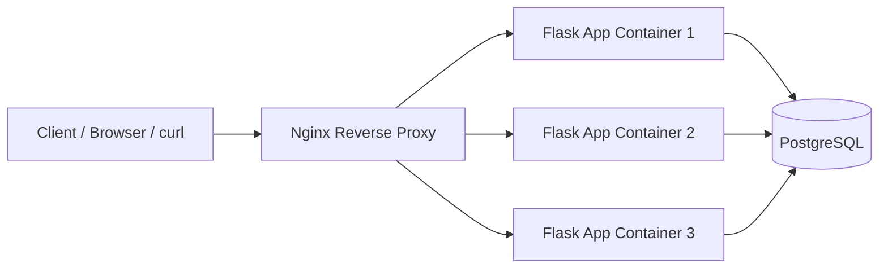

# PE Hackathon URL Shortener

Flask + Peewee + PostgreSQL URL shortener with Docker-based local setup.

## README Setup Instructions (Freshman Friendly)

### 1. Install tools

- Install Docker Desktop
- Install Git

Confirm both work:

```bash
docker --version
git --version
```

### 2. Clone the project

```bash
git clone <your-repo-url>
cd PE-Hackathon-Template-2026
```

### 3. Create or update `.env`

Make sure `.env` includes these keys (single value for each):

```env
FLASK_DEBUG=false
DATABASE_NAME=hackathon_db
DATABASE_HOST=localhost
DATABASE_PORT=5432
DATABASE_USER=postgres
DATABASE_PASSWORD=postgres
BASE_URL=http://localhost
DEVELOPEMENT_ENV=false
```

Important:

- Do not keep duplicate keys (example: two `DATABASE_PASSWORD` lines)
- `BASE_URL` should be set to avoid Docker warnings

### 4. Start everything with Docker

```bash
docker-compose down -v
docker-compose up --build --scale app=3 -d
```

### 5. Confirm services are healthy

```bash
docker-compose ps
```

Expected:

- `db` is `Up` and healthy
- `app` containers are `Up`
- `nginx` is `Up`

### 6. Quick health check

```bash
curl http://localhost/health
```

Expected response:

```json
{"status":"ok"}
```

## Architecture Diagram



## API Docs

Base URL (local): `http://localhost`

### Health

- `GET /health`
- Purpose: verify API is alive
- Success: `200` with `{"status":"ok"}`

### URL Shortener

- `POST /shorten`
- Purpose: create short URL
- Body:

```json
{
    "url": "https://example.com/page",
    "custom_alias": "optional-alias"
}
```

- Success: `200` or `201`

```json
{
    "short_url": "http://localhost/abc123"
}
```

- `POST /revoke`
- Purpose: revoke a short URL so it no longer redirects
- Body:

```json
{
    "short_code": "abc123"
}
```

- Success: `200`

```json
{
    "short_code": "abc123",
    "revoked": true
}
```

- `GET /<short_code>`
- Purpose: redirect to original URL if active
- Success: `302` redirect
- If revoked: `410`
- If unknown: `404`

### Users

- `GET /users`
- Purpose: list users (`?page=x&per_page=y` optional)

- `GET /users/<id>`
- Purpose: fetch a single user by ID

- `POST /users`
- Purpose: create user
- Body:

```json
{
    "username": "testuser",
    "email": "testuser@example.com"
}
```

- `PUT /users/<id>`
- Purpose: update user fields (`username`, `email`)

- `POST /users/bulk`
- Purpose: import users from CSV
- Request type: `multipart/form-data`
- File field name: `file`

### Basic endpoint test examples

```bash
curl -i http://localhost/health
curl -i http://localhost/users
curl -X POST http://localhost/users -H "Content-Type: application/json" -d '{"username":"alice","email":"alice@example.com"}'
curl -X POST http://localhost/shorten -H "Content-Type: application/json" -d '{"url":"https://example.com"}'
```

## Notes

- If any container keeps restarting, check logs with:

```bash
docker-compose logs <service-name> | tail -100
```

- If database auth fails, verify `.env` has one correct `DATABASE_PASSWORD`, then recreate with `docker-compose down -v`.
